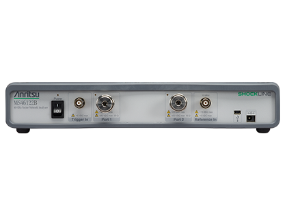
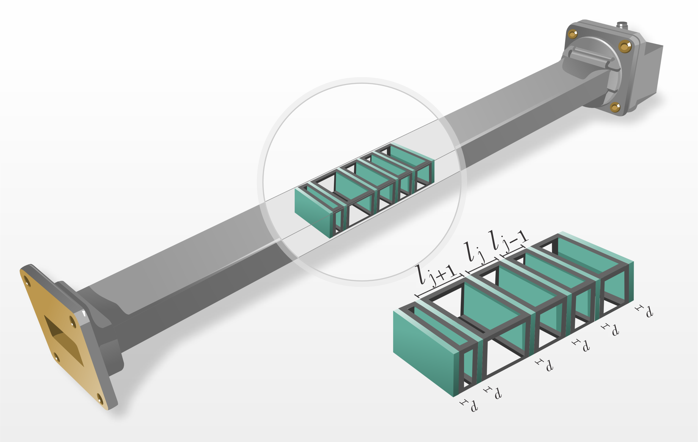

# Microwave Waveguide Dielectric Optimization Pipeline

This repository contains the data processing pipeline, theoretical modeling, and Python optimization scripts used to characterize the complex relative electrical permittivity ($\epsilon$) of non-equally spaced dielectric slabs (FR4) inside a WR90 waveguide.

##  Project Overview & Context: The R&D Workflow

The fundamental objective of this project is to create an accurate numerical model of a physical waveguide system. We utilize experimental data acquired from high-precision hardware to guide and validate a computational simulation, optimizing unknown material parameters.

### 1. Experimental Setup & Data Acquisition

*Figure 1: Real-world experimental setup on the bench. A Vector Network Analyzer (VNA) is connected via coaxial cables to the WR90 waveguide system containing the dielectric slabs. This setup was used to perform frequency sweeps (1 GHz to 12 GHz) and acquire raw S-parameters.*

### 2. Waveguide Geometry & Structural Diagram

*Figure 2: 3D structural model of the WR90 rectangular waveguide system. This geometry dictates the fundamental propagation modes (TE10) and the 6.6 GHz cutoff frequency, forming the precise physical boundaries required for the subsequent Transfer Matrix Method (TMM) calculations.*

##  Methodology: Optimization Pipeline

1. **Theoretical Modeling:** Implementation of the Transfer Matrix Method (TMM) in Python based on the geometric structure shown in Figure 2.
2. **Optimization Script:** Utilizing `scipy.optimize.minimize` (Nelder-Mead algorithm) to refine the complex permittivity ($\epsilon = \epsilon' + i\epsilon''$) by minimizing the error between the theoretical Transmission Coefficient ($|T|$) and the raw physical VNA measurements (from Figure 1).

*A full technical report detailing the mathematical formulation and full analysis is attached in this repository.*

##  Results & Visualization

Optimization based on the Transmission Coefficient yielded the most accurate representation of the physical system, resulting in an optimized relative permittivity of **$\epsilon \approx 5.546 + 0.066i$**.

### Experimental Data vs. Optimized Theoretical Model (Transmission $|T|$)

*Python-generated plot comparing raw VNA data (Red) vs the Optimized Theoretical Model (Blue). Notice the high fidelity fit after the 6.6 GHz waveguide cutoff frequency.*

##  Engineering Applications
This automated parameter-fitting pipeline demonstrates the ability to translate raw hardware sensor data (VNA) into refined numerical models, a critical skill for R&D roles in telecommunications, acoustic engineering, material science, and simulation-driven hardware design.
