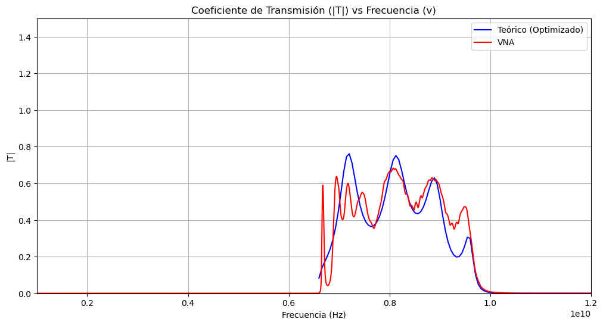
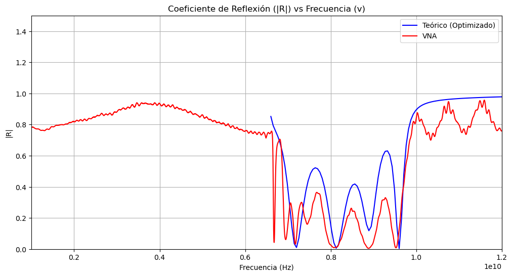

# Microwave Waveguide Dielectric Optimization Pipeline

This repository contains the data processing pipeline, theoretical modeling, and Python optimization scripts used to characterize the relative electrical permittivity ($\epsilon$) of FR4 slabs inside a WR90 waveguide.

##  Project Overview: The R&D Workflow

1. **Experimental Data Acquisition:** Vector Network Analyzer (VNA) sweeping from 1 GHz to 12 GHz to obtain raw S-parameters.
2. **Theoretical Modeling:** Implementation of the Transfer Matrix Method (TMM) in Python to model wave propagation through 8 non-equally spaced dielectric layers.
3. **Computational Optimization:** Utilizing `scipy.optimize.minimize` (Nelder-Mead algorithm) to refine the complex permittivity ($\epsilon = \epsilon' + i\epsilon''$) by minimizing the error between the theoretical Transmission Coefficient ($|T|$) and the physical VNA measurements.

*A full technical report detailing the mathematical formulation and analysis is attached in this repository.*

##  Results & Visualization

Optimization based on the Transmission Coefficient yielded the most accurate representation of the physical system, resulting in an optimized relative permittivity of **$\epsilon \approx 5.546 + 0.066i$**.

### Transmission Coefficient ($|T|$) Validation

*Python-generated plot comparing experimental data (Red) vs the Optimized Theoretical Model (Blue). Notice the high fidelity fit after the 6.6 GHz cutoff frequency.*

### Reflection Coefficient ($|R|$) Validation

##  Engineering Applications
This automated parameter-fitting pipeline demonstrates the ability to translate raw hardware sensor data (VNA) into refined numerical models, a critical skill for R&D roles in telecommunications, acoustic engineering, and simulation-driven hardware design.
